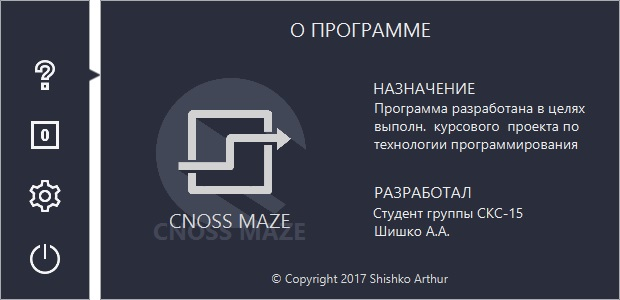
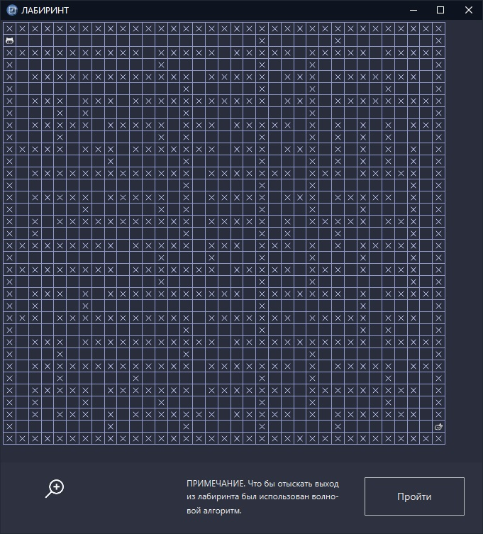
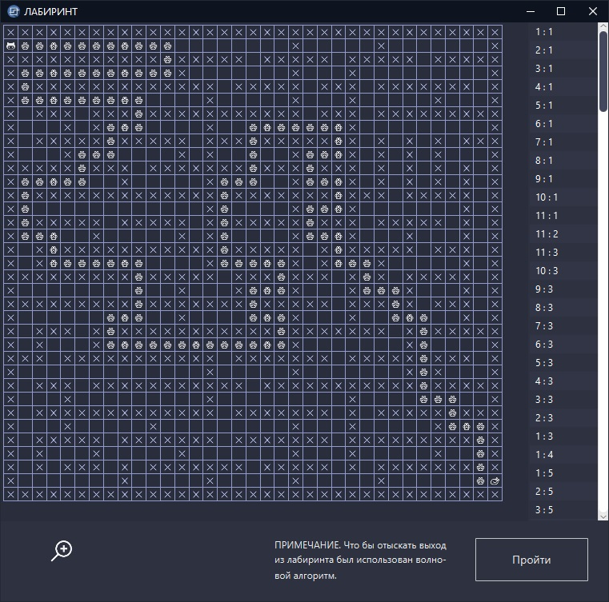
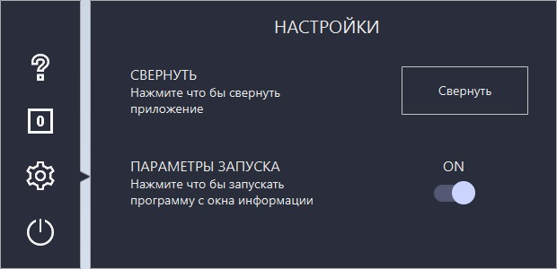

# CnossMaze
### Описание:
Программа, генерирующая лабиринт и путь его прохождения. Курсовой проект по "технологиям программирования" Шишко А.А. СКС-15 3-й курс. 
Для генерации лабиринта был использован алгоритм Эйлера. Для нахождения выхода из него был использован волновой алгоритм. Платформа для создания графического интерфейса JavaFx. 
### Дата:   
26.11.2017  
### Скриншоты:  
  
  
  
  
  
